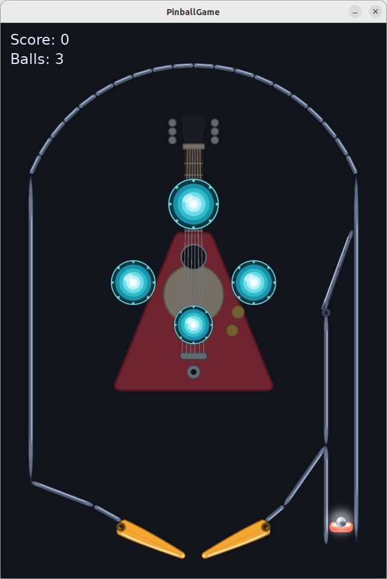

# PinballGame

A pinball game written in C++17 using the [SFML](https://www.sfml-dev.org/)
library for graphics, plus a small set of developer tools for building its art
assets. The game itself ships a complete, self-contained implementation on top
of the [Box2D](https://github.com/Box2D/Box2D) 2D physics engine: two flippers,
four bumpers, a chargeable plunger launcher, scoring, three balls per game and a
game-over screen.

The game builds SFML and Box2D in-tree from git submodules, so no system-wide
SFML / Box2D installation or `find_package` step is required. It also ships
`tools/svg2png`, a tool that rasterizes SVG art to PNG and packs several PNGs
into a single embeddable C++ texture atlas — see
[tools/svg2png.md](tools/svg2png.md) for its full documentation.

> **Note (project rename).** This project was renamed from `pimbalgame` to
> `pinballgame`. All in-game strings, the C++ namespace, the CMake target and
> executable name (`build/bin/pinballgame`), and the documentation have been
> updated accordingly.



## How this game was made

PinballGame was designed and implemented end-to-end by an AI coding agent,
[Ornith 1.5 35B-A3B](https://huggingface.co/ornith-ai/Ornith-1.5-35B-A3B) — a
sparse MoE LLM (35B total parameters, ~3B active) — running inside the
[DeepSeek Harness](https://github.com/deepseek-ai/deepseek-harness) agent loop.
Model inference was served locally with
[FreeToken](https://github.com/FlashML-org/FreeToken), a high-throughput
transformer inference engine for sparse models.

| Component        | Tool / Model                                                        |
| ---------------- | ------------------------------------------------------------------- |
| Coding agent     | [Ornith 1.5 35B-A3B](https://huggingface.co/ornith-ai/Ornith-1.5-35B-A3B) |
| Agent harness    | [DeepSeek Harness](https://github.com/deepseek-ai/deepseek-harness)     |
| Inference engine | [FreeToken](https://github.com/FlashML-org/FreeToken)                   |
| Runtime hardware | NVIDIA RTX 5070 Ti (16 GB VRAM), 96 GB DDR4 system RAM              |
| Game library     | [SFML](https://www.sfml-dev.org/) (Graphics, Window, System)        |

## Features

- **Fixed-timestep physics loop.** Box2D is advanced at a constant
  `1/120 s` sub-step, decoupled from the render rate (capped at 60 FPS), so the
  behaviour is deterministic and stable regardless of frame timing. Large frames
  (e.g. after losing window focus) are clamped to avoid the "spiral of death".
  Pixels are mapped to Box2D's metre space (100 px/m) so the ball, flippers and
  bumpers sit in the engine's comfortable range, and the fast ball is flagged as
  a bullet with continuous collision so it never tunnels.
- **Collision.** Box2D owns all collision: walls are two-sided segments, the
  flippers are thin kinematic boxes, the bumpers are static discs, the plunger is
  a box and the ball is a dynamic circle. The solver resolves every contact with
  per-shape restitution, and contact events drive the game logic (bumper kicks,
  scoring and sparks).
- **Flippers.** Two rotating flippers pivot around fixed points and swing between
  a resting and an active angle. Their angular velocity is transferred to the ball
  on contact, and an anti-stick guard prevents the ball from settling in the
  valley formed by an active flipper and the adjacent wall.
- **Bumpers.** Four circular bumpers apply a fixed radial kick and award points on
  contact, flashing briefly to give visual feedback.
- **Coin pickups.** A gold coin randomly appears on the open playfield every 8–10 s
  (randomised) at a spot clear of walls, flippers and bumpers, lasts 5–6 s
  (randomised) and then vanishes. Hitting it with the ball awards 2000 points,
  launches the ball off in a random direction at the same speed a flipper tip would
  impart, and removes the coin so it cannot be collected twice. Art: `assets/coin.svg`.
- **Plunger launcher.** Hold to charge a spring in the right channel; release to
  launch the ball with a power proportional to the charge.
- **HUD & game loop.** On-screen score, remaining balls and a "Game Over / restart"
  prompt. Three balls per game.
- **Menu & options.** A full game menu with **New Game**, **Options** and
  **Exit**. The Options view exposes General / Music / SFX volume sliders that the
  user scrolls with the mouse or clicks to jump. Pressing `Esc` during play pauses
  (freezing the physics) and shows the pause overlay; `Esc` again resumes, and
  **Exit** closes the window.
- **Portable font loading.** A bundled font is resolved relative to the executable
  (or source tree) at runtime, falling back gracefully if it is missing.

## Controls

| Action            | Keys                          |
| ----------------- | ----------------------------- |
| Left flipper      | `A`, `Z` or `←` (Left arrow)  |
| Right flipper     | `D` or `→` (Right arrow)      |
| Plunger (hold)    | `Space`                       |
| Restart (game over) | `R`                         |
| Pause / open menu | `Esc` (during gameplay)       |
| Quit (from menu)  | Menu → **Exit**, or the window close button |

During play, pressing `Esc` pauses and opens the menu; pressing `Esc` again
resumes. The menu offers **New Game**, **Options** (General / Music / SFX
volume sliders, adjusted by scrolling the mouse over a bar or clicking it) and
**Exit**. Arrow keys / the mouse wheel navigate, `Enter` / `Space` select, and
`Esc` goes back or resumes.

## Project layout

```
pinballgame/
├── CMakeLists.txt          # Top-level build configuration
├── dependencies/
│   ├── box2d/              # Box2D physics engine (git submodule, pinned v3.1.1)
│   ├── tiny-sound-font/    # TinySoundFont (git submodule, single-header) — used by the mid2ogg tool
│   └── sfml/               # SFML library (git submodule, built in-tree)
├── src/
│   ├── CMakeLists.txt      # Builds the game executable
│   ├── main.cpp            # Program entry point
│   └── pinballgame/
│       ├── Game.hpp/.cpp   # Window, main loop, input, HUD rendering
│       ├── World.hpp/.cpp  # Playfield geometry, physics, scoring, plunger
│       ├── Physics.hpp     # Shared geometry helper (closest point on a segment)
│       ├── Ball.hpp/.cpp   # The ball: state, gravity integration, speed clamp
│       ├── Flipper.hpp/.cpp # Rotating flipper with angular momentum transfer
│       ├── Bumper.hpp/.cpp # Circular scoring bumper with flash effect
│       ├── Particles.hpp/.cpp # Ball glow, trail and burst sparks
│       └── Textures.hpp/.cpp  # Embedded texture-atlas decoder
├── assets/
│   └── fonts/
│       └── DejaVuSans.ttf  # Bundled HUD font (copied next to the executable)
├── tools/
│   ├── svg2png/            # SVG→PNG rasterizer + texture-atlas packer
│   │   ├── CMakeLists.txt
│   │   ├── main.cpp
│   │   └── svg2png.md      # Full tool documentation (usage, modes, options)
│   ├── text2mid/           # Melody (mel language) → Standard MIDI File (.mid)
│   │   ├── CMakeLists.txt
│   │   ├── main.cpp
│   │   └── text2mid.md
│   └── mid2ogg/            # MIDI (.mid) → audio (.ogg), rendered via a SoundFont
│       ├── CMakeLists.txt
│       ├── main.cpp
│       └── mid2ogg.md      # Full tool documentation (usage, options)
├── .gitignore
└── README.md
```

## Prerequisites

The game itself needs only a C++17 compiler, CMake and Git. SFML is built
**in-tree** from the git submodule, so you do **not** need a system-wide SFML
installation or a `find_package(SFML)` step. What you *do* need are the low-level
**operating-system libraries** that SFML's `Window` and `Graphics` components link
against. On Linux these come as system packages; on macOS, Windows and Android
SFML fetches the text libraries (Freetype / HarfBuzz) itself and relies on the
platform's OpenGL / Cocoa / Win32 support.

> **CMake version:** the top-level `CMakeLists.txt` requires CMake 3.16, but the
> in-tree SFML submodule (3.1.0) requires **3.28**. CMake takes the higher of the
> two, so in practice **CMake >= 3.28** is needed.

| Requirement      | Minimum / note                                              |
| ---------------- | ----------------------------------------------------------- |
| C++ compiler     | GCC 7+, Clang 5+, or MSVC 2017+ (C++17)                     |
| CMake            | >= 3.28 (enforced by the SFML submodule)                    |
| Git              | for cloning and `git submodule update`                      |
| OpenGL           | system OpenGL implementation (Linux: Mesa / GLVND)          |
| Window system    | X11 (Linux) / Win32 (Windows) / Cocoa (macOS)               |

In addition to SFML's **System**, **Window** and **Graphics** components, the
game also links **Audio** to play its background music as a pre-rendered Ogg
Vorbis track, so the Audio codec extras — **Vorbis**, **FLAC** and **Ogg** (and
gsm) — are now required. The Network and Libssh2 extras are still **not**
required.

### Linux (Debian / Ubuntu) — verified build

On Linux SFML uses the **system** text libraries by default, so Freetype and
HarfBuzz are required too. Everything below is the exact set that configures and
builds the project cleanly on a fresh machine:

```bash
# Build tools
sudo apt install build-essential cmake git

# SFML Window (X11 backend) — Xrandr, Xcursor and Xi are the only X11
# components SFML 3.1.0 links against; keyboard handling uses XKBlib from libx11-dev
sudo apt install libx11-dev libxi-dev libxrandr-dev libxcursor-dev \
                 libgl-dev libudev-dev

# SFML Graphics text rendering (system Freetype + HarfBuzz)
sudo apt install libfreetype6-dev libharfbuzz-dev

# SFML Audio (background music: Ogg Vorbis playback) — Ogg / Vorbis / FLAC codecs
sudo apt install libogg-dev libvorbis-dev libflac-dev
```

> Older SFML 2.6 guides also list `libxinerama-dev` and `libxkbcommon-dev`;
> SFML 3.1.0 does **not** link those here, so they are unnecessary.

Same libraries on other distributions (package *names* differ, the libraries are
the same):

```bash
# Fedora / RHEL (-devel suffix, Mesa as mesa-libGL-devel)
sudo dnf install gcc-c++ cmake git \
    libX11-devel libXi-devel libXrandr-devel libXcursor-devel \
    mesa-libGL-devel libudev-devel freetype-devel harfbuzz-devel \
    libogg-devel libvorbis-devel libflac-devel

# Arch Linux (runtime + headers merged; base-devel supplies the compiler)
sudo pacman -S base-devel cmake git \
    libx11 libxi libxrandr libxcursor mesa libudev freetype harfbuzz \
    libogg libvorbis flac
```

> **Optional:** to avoid installing Freetype / HarfBuzz (and instead let SFML
> download and build them from source via CMake `FetchContent`), configure with
> `-DSFML_USE_SYSTEM_DEPS=OFF`. This needs network access at configure time.

### macOS

Only a compiler, CMake and Git are needed — SFML fetches Freetype / HarfBuzz
itself and uses the platform's OpenGL/Cocoa stack (no X11). As the game plays its
background music with SFML's Audio module now, also install the Ogg Vorbis / FLAC
codec libraries:

```bash
brew install cmake git libogg libvorbis libflac   # or: brew install sfml  (prebuilt SFML)
```

### Windows

Install [Visual Studio 2022](https://visualstudio.microsoft.com/) (the **C++
desktop development** workload, which provides MSVC) plus CMake and Git. SFML
fetches the text libraries itself and uses the system OpenGL driver. As the game
plays its background music with SFML's Audio module, also provide the Ogg Vorbis
/ FLAC codec libraries (or configure with `-DSFML_USE_SYSTEM_DEPS=OFF` so SFML
builds its own codecs from source, which needs network access at configure time).

## Getting started

Clone the repository **with submodules** so that SFML is available:

```bash
git clone --recurse-submodules <repo-url> pinballgame
cd pinballgame
```

If the submodule is already present, initialize/update it:

```bash
git submodule update --init --recursive
```

### Configure & build (Linux / macOS)

```bash
mkdir -p build
cd build
cmake ..
cmake --build .
```

The executable will be produced at `build/bin/pinballgame`.

### Configure & build (Windows)

```bat
mkdir build
cd build
cmake .. -G "Visual Studio 17 2022"
cmake --build . --config Release
```

## Running

```bash
./build/bin/pinballgame   # Linux / macOS
```

On Windows the executable is at `build\Release\pinballgame.exe`. The bundled font
is copied next to the executable by the build so it can be located at runtime.

## Release notes

The game's developer tools are documented alongside their sources:
[`tools/svg2png`](tools/svg2png.md) turns the project's SVG art into PNG
textures and packs them into an embeddable C++ texture atlas,
[`tools/text2mid`](tools/text2mid.md) synthesises a Standard MIDI File from a
melody written in the project's own "mel" note language, and
[`tools/mid2ogg`](tools/mid2ogg.md) renders a MIDI file into an Ogg Vorbis
sound using a SoundFont. Their full documentation (usage, options, language)
lives in those files; the tools are summarised here in the release notes.

| Version | Summary |
| ------- | ------- |
| 1.0.0 | Initial release: a simple pinball game. |
| 1.1.0 | Added `tools/svg2png`, a developer tool for turning the game's SVG art into PNG textures. |
| 1.2.0 | Embedded texture atlas fed by `svg2png`, plus a particle system for the ball's visual flair. |
| 2.0.0 | Swapped the in-house physics for the Box2D engine (submodule, pinned v3.1.1). |
| 2.1.0 | Fixed the plunger launching the ball even when it wasn't resting on the launch pad. |
| 2.2.0 | Added a vertical wall sealing the left side of the plunger launch lane so the ball no longer slips past the pad and drains. |
| 2.3.0 | Fixed the anti-stick guard never firing, which let the ball settle forever in the valley between an active flipper and the wall. |
| 2.4.0 | Added continuous background music: the MIDI is rendered against the SoundFont with TinySoundFont and played on loop via SFML. |
| 2.5.0 | Added procedural sound effects: short blips for the plunger, bumpers, walls, flippers and ball drain, synthesised from a tiny note language. |
| 2.6.0 | Dropped the flipper pivots 10px below the adjacent wall so a ball rolling down the wall lands on the top of the resting flipper body instead of wedging in the pivot corner. |
| 2.7.0 | Fixed a resting flipper that kept imparting speed to the ball after being moved once: the kinematic body retained a residual spin, so the idle flipper now acts as a true static wall. |
| 2.8.0 | Added a full game menu (New Game / Options / Exit) with per-category volume sliders and an Escape-to-pause overlay, plus `tools/text2mid` and the `mel` note language used to author the in-game theme (`assets/sounds/flipper_fever.mid`). |
| 2.9.0 | Added a one-way flap valve at the top of the launch channel so an in-play ball can never fall back onto the plunger. |
| 2.10.0 | Added a random coin pickup that appears on the open playfield, awards 2000 points, redirects the ball and vanishes on collection. |
| 2.11.0 | `text2mid` now writes melodies with **up to 4 independent voices** (1–4). Each voice runs on its own timeline and plays in parallel (like the separate channels of a real MIDI file — not sequential, not round-robin) and can use a different named instrument. See [tools/text2mid.md](tools/text2mid.md). |
| 2.12.0 | Added `tools/mid2ogg`, which renders a Standard MIDI File into an Ogg Vorbis (`.ogg`) sound file by playing it back against a SoundFont with TinySoundFont (the same path the game uses) and encoding the result with SFML. See [tools/mid2ogg.md](tools/mid2ogg.md). |
| 2.13.0 | Replaced the load-time TinySoundFont MIDI→SoundFont synthesis with a pre-rendered Ogg Vorbis background track (`pinball_pirates.ogg`), played directly on loop via SFML. Removed the SoundFont and theme MIDI assets (`sound_file.sf2`, `flipper_fever.mid`, `texas_e_pacific_boogie_woogie_bass.mid`). |
| 2.14.0 | Reworked the ball contact sound effects into realistic metallic impacts parameterised by impact speed: a broadband noise "crack" plus inharmonic, exponentially-decaying partials, so harder hits ring brighter and longer. Tonal note-language blips are kept for the plunger and ball drain. |
| 2.15.0 | Refined all nine sprite art assets for a darker, richer look, and redesigned the background skull watermark as a full Jolly Roger (crossed bones, doubled canvas, same game-space position). |

### v1.2.0

- **Embedded texture atlas for the game.** `assets/*.svg` are now the only
  version-controlled art. At build time the `svg2png` tool rasterizes every SVG
  to a transparent PNG and packs them into a single embeddable C++ header
  (`textures.cxxpng`) that the game `#include`s; `src/pinballgame/Textures.cpp`
  decodes the in-memory atlas and hands out sprites by name. The game ships no
  image files, and falls back to rendering procedural shapes when configured
  without the art tool (`-DBUILD_TOOLS=OFF`).
- **Particles.** An additive-blended particle system gives the ball a soft glow
  halo that brightens with speed, a comet-like trail when moving fast, and short
  bursts of sparks on bumper / flipper contact and on the plunger launch.
- **Physics tweaks.** Refinements to the flipper, bumper and ball handling
  around contact and restitution.

The `svg2png` tool is built only when the project is configured with
`-DBUILD_TOOLS=ON` (default `ON`), wired through the top-level `CMakeLists.txt`.

### v2.0.0

- **Box2D physics engine.** The hand-rolled physics loop (custom closest-point
  segment collision, manual impulse reflections and separate ball integration)
  was replaced by the [Box2D](https://github.com/Box2D/Box2D) engine, added as a
  git submodule pinned to v3.1.1. Box2D now owns all collision and contact
  resolution. Game logic and rendering stay in pixels; a `100 px/m` scale maps
  them into Box2D's metre space, the ball is a fast "bullet" circle with
  continuous collision, and the flippers are kinematic bodies so their swing
  transfers momentum to the ball through the solver.
- **Rebuilt contact handling.** Bumper kicks and scoring now fire from Box2D's
  contact events instead of a manual ball-vs-bumper pass, and the flipper and
  plunger effects run after each physics sub-step. The fixed `1/120 s`
  timestep and 60 FPS render cap are unchanged.

### v2.1.0

- **Plunger launch fix.** Releasing the plunger no longer flings the ball when it
  is not on the launch pad. Previously the release impulse was applied to the
  ball unconditionally, so holding and letting go of the plunger would push the
  ball even when it was anywhere else on the table. The launch now only applies
  when the ball is inside the right-channel lane and essentially resting on (or
  just above) the pad, so a real ball must be seated on the plunger to be
  launched — the same flaw existed in the pre-Box2D custom-physics loop.

### v2.2.0

- **Plunger launch lane sealed on the left.** A vertical wall was added along
  `kChannelLeft` (x=540) from y=700 down to just above the floor (y=865). The
  right side of the launch lane already had the `kRight` rail, but below y=700
  the left side was only the diagonal guide above, so a ball returning down the
  lane could slip past the left of the plunger pad and drain. This wall mirrors
  the right rail and keeps the lane straight onto the pad, so the ball rests on
  the plunger and can be launched instead of being lost. Existing walls are
  unchanged; this only adds one segment.

### v2.3.0

- **Anti-stick guard fixed.** A ball sliding down the guide wall and slowing
  near a held flipper used to settle *permanently* in the valley between the
  flipper and the adjacent wall (the pivot corner), never moving again. The
  guard that was supposed to prevent this was dead code: it decided the ball was
  "in contact" when its centre was within one ball radius of the flipper's
  pivot->tip **centre-line**, but the collision box is centred on that line and
  the ball rests against its **surface**, a half flipper-thickness (~13px)
  beyond it. On contact the ball's centre is therefore ~22px from the line, so
  the `dist < radius` test was never true and the guard never fired. The check
  now engages at `radius + half-thickness (+ slack)`, so the guard pushes the
  ball off the surface as soon as it settles, exactly as intended. The flipper
  pivots were also restored to (200, 825) / (440, 825).

### v2.4.0

- **Background music.** The game now plays continuous background music. A
  SoundFont (`assets/sounds/sound_file.sf2`) and a MIDI file
  (`assets/sounds/flipper_fever.mid`) are loaded at startup
  and the track is synthesised with [TinySoundFont](https://github.com/schellingb/TinySoundFont)
  (the single-header `tsf.h` + `tml.h`, added as a git submodule). The MIDI is
  replayed against the SoundFont — dispatching program, note-on/off, pitch-wheel
  and control-change messages as a virtual playback clock advances — and the
  rendered 16-bit stereo samples are cached in a `std::vector`. That cache is
  then handed to an `sf::SoundBuffer` wrapped by an `sf::Sound`, which plays on
  loop. Rendering once up front keeps the gameplay audio thread free of
  synthesis; the whole track lives in memory, which is fine for a short loop.
  A `Music` component (`src/pinballgame/Music.{hpp,cpp}`) owns the render and
  playback; `Game` loads and starts it, resolving the assets next to the
  executable (falling back to `assets/sounds/`). SFML's Audio module is built
  against the system Vorbis/FLAC/Ogg libraries (`SFML_USE_SYSTEM_DEPS=ON`), so no
  in-tree codec build is needed. If the assets cannot be loaded the game still
  runs, just muted.

> _Superseded by [v2.13.0](#v2130): the TinySoundFont synthesis path was removed, so
> the game no longer needs a SoundFont or a theme MIDI at runtime. The track is now a
> pre-rendered Ogg Vorbis file — see v2.13.0 for the current implementation._

### v2.5.0

- **Procedural sound effects.** In addition to the background music, the game
   now plays synthesised sounds for gameplay events — plunger pull and release,
   bumper hits, wall and flipper bumps, coin pickups and the ball draining. A new
   `SoundEffect` component (`src/pinballgame/SoundEffect.{hpp,cpp}`) owns them,
   using a tiny note language rather than stored audio files. Two families of
   effect live side by side:
   - **Tonal effects** (plunger pull/release, ball drain) are short melodic
     snippets described by the note language, e.g. `"@180 ~square C3e E3e G3e"`
     (180 BPM, square wave, then C3/E3/G3 as eighths). A note is
     `[A-G][#|b][octave][suffix]` where the suffix sets the duration
     (`w`/`h`/`q`/`e`/`s`/`t` = whole/half/quarter/eighth/sixteenth/triplet);
     `R` is a rest and `~<waveform>` picks `sine`, `square`, `saw` or
     `triangle`. They are rendered once at construction into a cached PCM
     `std::vector` and simply replayed, so the per-frame cost is just a map
     lookup and a cheap restart.
   - **Metallic impact effects** (ball vs. bumper / wall / flipper / coin) are
     rendered *on the fly*, per hit, from an impact-speed value. A strike is
     modelled as a short broadband noise "crack" summed with several
     inharmonic, exponentially-decaying partials (the way a struck steel plate
     or bell sounds). The ball's speed at contact scales the pitch, brightness,
     number of partials, ring length and overall level, so a gentle tap sounds
     dull and short while a hard hit rings bright and long -- matching real
     pinball physics instead of a fixed chime.

   Playback is decoupled from the game loop: `play()` just enqueues the effect
   name (and, for impacts, the impact speed) onto a small bounded queue and
   returns immediately; two worker threads drain it and play in parallel on the
   shared SFML audio device (the same one the music uses). Each worker owns its
   own private voice bank, so the two workers run without locking on the hot
   path. `World` triggers the effects from the plunger edge transitions,
   ball<->bumper/wall/flipper/coin contact events and the drain check; `Game`
   builds the bank and shares it with the `World`.

### v2.7.0

- **Resting flipper no longer kicks the ball.** A flipper used to keep launching
  the ball even after it was released and left motionless for the rest of the
  game — and only *after* it had been swung at least once. The flippers are
  Box2D kinematic bodies driven each frame by `b2Body_SetTargetTransform`, which
  sets the body velocity needed to reach the requested angle in one step and
  **returns early without touching the velocity** whenever that requested
  velocity is below the sleep threshold. On the settling frame that velocity is
  zero, so the leftover swing velocity of the previous frame is never cleared,
  and a kinematic body (`invMass == 0`, zero damping) preserves its velocity
  across steps forever. That lingering spin then smacked the ball on every
  contact, so a resting flipper gave the ball extra (vertical) speed instead of
  acting as a wall. The fix zeroes the body's linear and angular velocity in
  `Flipper::update()` as soon as the flipper settles at its target angle
  (`mAngularVelocity == 0.0f`), while a swinging flipper is unaffected, so swing
  momentum is preserved. A falling ball now bounces off a resting flipper like a
  wall, a sliding ball keeps sliding, and only an active swing launches it.

### v2.8.0

- **Game menu, pause overlay and volume options.** The game now boots into a full
  menu with three real actions — **New Game** starts a fresh game, **Options**
  opens the volume controls, and **Exit** closes the window. The Options view
  exposes three sliders (General / Music / SFX): scrolling the mouse over a bar
  changes it, clicking the bar jumps it, and the focused bar can also be nudged
  with the left/right arrow keys. The three levels compose multiplicatively, so
  the applied level is `general * category` — a genuine master volume on top of
  the per-category sliders — and `Game` writes the result straight onto the
  music and sound-effect playback sources, so the sliders are effective.
  Pressing `Esc` during play pauses: the fixed-timestep physics loop stops (the
  world freezes behind a translucent backdrop) and the pause overlay is shown, and
  pressing `Esc` again resumes. The overlay reuses the same navigation (`Resume`,
  volume sliders, `Main Menu`, `Quit`).
- **`tools/text2mid` and the `mel` note language.** The background theme is
  authored with a new, self-contained C++17 tool,
  [`tools/text2mid`](tools/text2mid.md), which synthesises a Standard MIDI File
  from a melody written in the project's own **"mel"** language. A melody is just
  a whitespace/comma-separated stream of `[A-G]` note letters (with optional
  `#`/`b` and a digit octave, `C4` == MIDI 60), `r` rests, `+`-joined chords, an
  optional `/denominator` beat length, and `tempo`/`octave` directives. The phrase
  is repeated to fill the requested duration (15–25 s) and written as a
  format-1, single-track MIDI. Running it with no `--instruction` defaults to the
  shipped `flipper_fever.mid` theme. The generated file is copied next to the
  executable at build time and played by the same TinySoundFont path as before, so
  the whole loop — from a short text string to in-game music — is produced without
  any third-party audio authoring tools. Full documentation lives in
  [tools/text2mid.md](tools/text2mid.md).
  - **The shipped theme, `flipper_fever.mid`.** A heavy, pirate-flavoured rock
    loop in E minor (E Dorian flavour, resolving to a B-dominant power chord). It
    is a single palm-muted guitar line: a galloping E-minor riff over three bars
    that ends on a whole-note B power chord, so the loop wraps **B (dominant) → E
    (tonic)** — a V→i resolution — which keeps the seamless loop coherent. The
    exact `mel` instruction (132 bpm, 4/4) written to produce it is:

    ```
    tempo 132
    E2/8 E2/8 E2/16 E2/16 B1/8 A2/8 A2/16 A2/16 C3/8 B2/8
    G2/8 G2/8 G2/16 G2/16 A2/8 B2/8 B2/16 B2/16 C3/8 D3/8
    C3/8 C3/8 C3/16 C3/16 B2/8 A2/8 A2/16 A2/16 B1/8 B2/8
    B1+F#2+B2/1
    ```

    Regenerate it with:

    ```bash
    text2mid --save-path assets/sounds/flipper_fever.mid \
      --instruction "tempo 132 E2/8 E2/8 E2/16 E2/16 B1/8 A2/8 A2/16 A2/16 C3/8 B2/8 \
      G2/8 G2/8 G2/16 G2/16 A2/8 B2/8 B2/16 B2/16 C3/8 D3/8 C3/8 C3/8 C3/16 C3/16 B2/8 A2/8 A2/16 A2/16 B1/8 B2/8 B1+F#2+B2/1"
    ```

> _Retired in [v2.13.0](#v2130): `assets/sounds/flipper_fever.mid` was removed along with the
> TinySoundFont synthesis path. The game now plays the pre-rendered `pinball_pirates.ogg`, and
> the `mel` theme above is kept only for reference — `text2mid` still generates it on demand._

### v2.9.0

- **One-way flap valve on the launch channel.** A metal valve plate now closes the
  mouth of the launch channel (the gap above the end of the channel's left wall,
  at x=540 / y=480) all the way up to the right rail. The plate is hinged at its
  lower end on the wall's top endpoint — the wall ends exactly at the valve pivot
  — and it can only swing open *upward*, out of the channel. A launched ball meets
  its underside at a shallow angle and slides up over it, pushing the plate open
  with almost no resistance; gravity seats it shut again the moment the ball
  passes. Anything later trying to fall back down into the channel presses the
  plate *down*, which the closed limit blocks, so an in-play ball can no longer
  roll back onto the plunger. New balls are now placed straight onto the plunger
  pad instead of being dropped down the channel. Art: `assets/valve.svg`.

### v2.10.0

- **Coin pickups.** A gold coin now randomly appears on the open playfield, giving a fresh target to chase. Spawn timing, position and lifetime are all randomised: a coin shows up every 8-10 s (random), at a spot chosen by rejection sampling so it never overlaps a wall, flipper or bumper - it only appears inside the region the ball can actually reach - and lasts 5-6 s (random) before vanishing on its own. Hitting it with the ball does three things: it awards 2000 points, it launches the ball off in a *random* direction at *any* angle, and it imparts the same speed the ball would gain from a flipper-tip swing (reused from `Flipper::peakTipSpeed`), so the coin feels like a small, rewarding bump rather than a static bonus. The coin is removed the instant it is collected, so the ball can never score it twice as it rebounds off neighbouring objects. A static Box2D circle carries the collision so the ball genuinely strikes it, and a fresh `coin.svg` art asset feeds the texture atlas (sound: `ball_hit_coin`).

### v2.11.0

- **`text2mid` multi-voice melodies.** The theme synthesiser now writes melodies with **up to four independent voices** (1-4). Each voice loops its own phrase on its *own* timeline and plays in parallel with the others, like the separate channels of a real multi-track MIDI file — voices are neither sequential nor round-robin, so a fast and a slow voice overlap freely. A voice is started with `voice <1-4>` (or `v <1-4>`), and its instrument is set with `program <name>` (aliases `prog` / `inst`), either by name (`piano`, `guitar`, `bass`, `strings`, `flute`, `lead`, `drums`, ...) or by a raw MIDI program number (0-127). `drums` is routed to the MIDI drum channel (ch. 10), where the game's renderer already enables drum-kit mode. The default instruction is unchanged, so existing single-voice themes are byte-for-byte identical. See [tools/text2mid.md](tools/text2mid.md) for the full `mel` grammar.

### v2.12.0

- **`mid2ogg` render a MIDI into a loopable sound file.** The new `tools/mid2ogg` tool turns a Standard MIDI File (`.mid`) into an Ogg Vorbis sound file (`.ogg`). A MIDI file only contains notes, so the tool *plays it back* against a SoundFont (`.sf2`) with TinySoundFont and encodes the captured PCM with SFML's Ogg Vorbis writer. To make the result loop with no dead air, the captured PCM is analysed from both ends (RMS energy over short windows) and everything below an audible threshold is trimmed, so the file starts and ends on real audio instead of the instruments' decaying/reverb tail. Usage: `mid2ogg --save-path my-sound.ogg --mid-path my-sound.mid` (add `--soundfont-path <in.sf2>` to render against a different SoundFont). Its full documentation lives in [tools/mid2ogg.md](tools/mid2ogg.md).

> This tool is independent of the game's background music, which [v2.13.0](#v2130) moved to a
> pre-rendered Ogg Vorbis track (`pinball_pirates.ogg`). The TinySoundFont→SoundFont path this
> tool uses is no longer taken by the game itself.

### v2.13.0

- **Background music is now a pre-rendered Ogg track.** The game's background music no longer
  needs a SoundFont or a MIDI file at runtime: `src/pinballgame/Music.{hpp,cpp}` now loads the
  Ogg Vorbis file `assets/sounds/pinball_pirates.ogg` straight into an `sf::SoundBuffer` and
  plays it on loop through an `sf::Sound`. SFML's Audio module decodes Vorbis natively (it is
  built against the system Ogg/Vorbis/FLAC libraries), so the load path is a single decode
  rather than a full render — small and cheap, with no bespoke codec and no synthesis on the
  audio thread. `Game` resolves the track next to the executable (falling back to
  `assets/sounds/`), copies it next to the binary at build time, and still starts playback via
  `Music::play()`; if the file cannot be loaded the game still runs, just muted.
  - The previous TinySoundFont synthesis path (a SoundFont + theme MIDI replayed against it)
    was removed **entirely**. The assets `assets/sounds/sound_file.sf2`,
    `assets/sounds/flipper_fever.mid` and `assets/sounds/texas_e_pacific_boogie_woogie_bass.mid`
    were deleted, and the `tiny-sound-font` submodule is now used only by the `tools/mid2ogg`
    developer tool — not by the game. The in-game theme is no longer authored or rendered from
    `assets/sounds/flipper_fever.mid`.

### v2.14.0

- **Ball contact sounds are now realistic metallic impacts, parameterised by impact speed.**
  Before this release every effect was a short melodic blip written in the project's note
  language, so the ball vs. bumper / wall / flipper / coin contacts rang out as fixed musical
  notes. The contact effects now read as struck metal. Each strike is synthesised on the fly as
  a short broadband noise **"crack"** (one-pole low-passed so it is a "tock", not white-hiss)
  summed with several **inharmonic, exponentially-decaying partials** — the way a steel plate or
  bell sounds, where the higher modes decay fastest and the hit rings down from bright to dull.
- **Impact speed drives the character.** `World` now passes the ball's speed at contact
  (`mBall.velocity.length()`) to a new `SoundEffect::play(name, impactSpeed)` overload. The speed
  scales the pitch, brightness, number of partials, ring length and overall level: a gentle tap
  sounds dull and short, a hard hit rings bright and long, and the ball **attenuates** with the
  energy of the strike instead of playing a single fixed note. Each of the four surfaces has its
  own `SoundEffect::MetallicConfig` (base frequency, frequency sweep, brightness, decay, level,
  noise gain and partial count) so a bumper, wall, flipper and coin each keep a distinct metal
  voice, tuned inline in the `SoundEffect` constructor.
- **Tonal blips are kept where they belong.** The plunger pull/release and the ball-drain sounds
  remain the melodic note-language effects, so their character is unchanged.
- **The playback architecture is untouched.** Effects are still rendered into PCM and queued onto
  the small bounded work queue; two worker threads drain it and play in parallel on the shared
  SFML audio device, each owning its own private voice bank. Impact effects are rendered per hit
  on the worker thread (no synthesis on the main loop) and reloaded into the next voice's buffer,
  so the hot path stays lock-free.

### v2.15.0

- **Art refresh for all nine sprites.** Every `assets/*.svg` art asset was reworked for a darker,
  more layered look:
  - `ball.svg` — smoother lower-right shadow falloff (two stacked shadow layers), a crisper
    outer edge, and a fainter rim light; the steel tones read as one polished sphere.
  - `bumper.svg` — eight studs set into the ring between the rim and the glow core, a darker ring
    base, and refined concentric glow-band radii so the hot core stands out.
  - `coin.svg` — two-layer star relief (dark under, bright over), brighter brass face, and a
    lower rim-light arc for a more embossed look.
  - `flipper.svg` — a dark belly edge, a faint centre ridge that makes the taper read, a larger
    pivot bearing with rim and highlight, and a brighter tip cap.
  - `glow.svg` — a finer additive gradient (ten concentric circles instead of seven) so the
    ball halo and particle cores fade more smoothly to a transparent edge.
  - `plunger.svg` — a mid-tone band so the pad reads as a cylinder, plus darker body and grip
    tones.
  - `valve.svg` — the plate is now a tapered path instead of a plain rect, the rivets gain tiny
    highlights, and a hinge boss marks the pivot end.
  - `wall.svg` — brighter top sheen, a deeper shadow band, and faint end caps so each rail reads
    as a single polished piece.
  - Each file now carries a documentation comment stating its origin point and the texel radius
    the game scales onto the matching physics radius.
- **Jolly Roger skull watermark.** `skull.svg` was redesigned as a full Jolly Roger: crossed bones
  with knobby bone ends now sit behind the head, which gained a crack down the front of the
  cranium, larger eye sockets, and a rounded mouth gap with more teeth septa. The canvas doubled
  from 300x340 to 600x680 and the art is centred on the canvas, so the sprite origin moved from
  `(150, 170)` to `(300, 340)` in `World.cpp`; the position `(320, 402)`, the 0.80 scale and the
  faint alpha (110/255) are unchanged, so the watermark lands at the same game-space point but
  renders ~480 px wide instead of ~240 px.

## License

This project is licensed under the [MIT License](LICENSE).